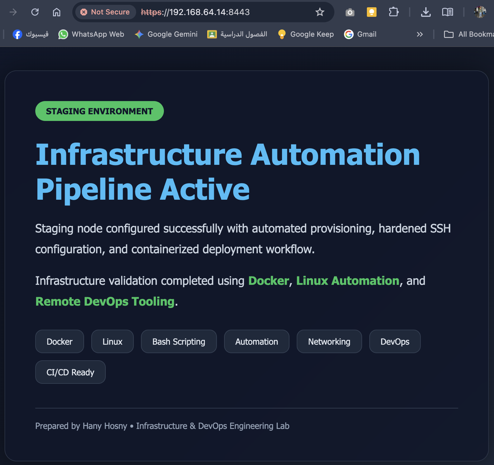

# Infrastructure Automation with Docker & Nginx

Automated infrastructure provisioning using Bash, Docker, and Nginx with HTTPS support.

## Overview

This project automates the setup of a basic web server environment on Ubuntu. The script installs Docker (if needed), generates a self-signed SSL certificate, configures an Nginx container, enables HTTPS, and verifies the deployment with an automated health check.

## Features

- Root privilege validation
- Create application user and group
- Create secure application directory
- Generate a system health report
- Install Docker automatically (if not installed)
- Generate a self-signed SSL certificate using OpenSSL
- Deploy Nginx in a Docker container
- HTTP to HTTPS redirection
- Automatic deployment verification

## Project Structure

```
infra-automation/
├── images/
│   └── demo.png
├── certs/
├── index.html
├── nginx.conf
├── onboarding_automation.sh
└── README.md
```

## Technologies Used

- Bash
- Docker
- Nginx
- OpenSSL
- Ubuntu Linux

## How to Run

Clone the repository:

```bash
git clone -b feature/onboarding-automation https://github.com/Hany-Hosny/infra-automation.git
cd infra-automation
```

Make the script executable:

```bash
chmod +x onboarding_automation.sh
```

Run the script:

```bash
sudo ./onboarding_automation.sh
```

## Access the Website

HTTP

```
http://<SERVER_IP>:8080
```

HTTPS

```
https://<SERVER_IP>:8443
```

> Because a self-signed certificate is used, your browser will display a security warning. This is expected.

## Health Check

The deployment is verified automatically.

Example:

```bash
curl -I http://localhost:8080
```

Expected response:

```
HTTP/1.1 301 Moved Permanently
```

## Demo



## Future Improvements

- Replace the self-signed certificate with Let's Encrypt.
- Add Docker Compose support.
- Integrate the deployment into a CI/CD pipeline using GitHub Actions.
- Add automated testing before deployment.

## Author

**Hany Mohamed Hosny**

- GitHub: https://github.com/Hany-Hosny
- LinkedIn: https://www.linkedin.com/in/hany-h0sny/
